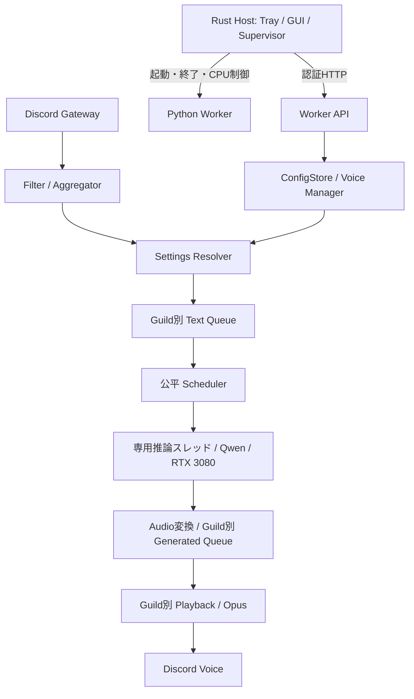

# DiscordSpeakBot 詳細設計

作成日: 2026-09-24 / 状態: 実装前の設計案

## 1. 位置づけと採用判断

`build.md` を要件資料として、実装に必要な責務、データ、状態遷移、異常処理、検証手順を具体化する。本書の数値のうち原資料にないものは初期提案値であり、実測で調整する。アプリケーションの実装や性能検証は本書の作成には含まない。

対象は Windows 11、Ryzen 9 9950X3D、RAM 64GB、RTX 3080 10GB。Rust HostとPython Workerを別プロセスにする。READMEのWSL記述とは相違があるため、今回は詳細な要件があるbuild.mdに合わせWindowsネイティブを基準とする。WindowsでTTS依存関係が成立しない場合は、WSL案を別途判断する。WSLへ変更する際はCPU制御、パス、秘密情報の受け渡し、監視方式を再設計する。

| 項目 | 本設計の判断 |
|---|---|
| Host | Rust、tray-icon、egui/eframe、Win32 APIを採用候補とする |
| Worker | Python、discord.py、FastAPI、Uvicorn、Pydanticを採用候補とする |
| モデル | `Qwen/Qwen3-TTS-12Hz-1.7B-Base`を第一候補、0.6B-Baseを比較対象 |
| 推論 | 単一モデル、専用実行スレッド1本、初期同時生成数1 |
| IPC | 認証付きHTTP、127.0.0.1:8765、`/internal/v1` |
| 保存 | JSON、Workerが設定の唯一の書き込み主体 |
| GPU | RTX 3080をUUIDで選択し起動時に照合。CUDA番号0を固定的に信用しない |
| 配布 | Host実行ファイル＋専用Python環境。依存バージョンは実機検証後に固定 |
| 後続段階 | 3 Guild、バッチ化、外部管理、Fine-tuning |

build.mdの`max_parallel=3`は初期値として採用しない。3 Guildの同時接続・再生と、GPUでの3件同時生成は別の能力である。まず逐次推論で3 Guildに公平にサービスし、バッチ化はVRAMと遅延の測定後に導入する。

## 2. 構成と責務



Hostはモデルをロードせず、Discordの状態を直接書き換えない。Worker内のasyncioループがGateway、HTTP、キュー状態を管理する。同期的な推論処理は専用スレッドへ隔離し、完了通知をイベントループへ戻す。モデル操作、音声プロファイル生成、試聴生成も同じ実行レーンへ直列化する。

CPU処理がイベントループやHeartbeatを阻害しないことを測定する。スレッド分離で不十分な場合は、後続段階で推論専用子プロセスを導入する。MVPでは障害時にWorker全体を再起動する。

## 3. 配置とモジュール

```text
DiscordSpeakBot/
  build.md                         元の要件資料
  docs/design.md                   本書
  host/
    Cargo.toml
    src/{main,tray,gui,supervisor,ipc,cpu_sets,secrets,monitoring}.rs
  worker/
    pyproject.toml
    src/discord_speak_bot/
      __main__.py
      discord_adapter/{bot,commands,playback}.py
      pipeline/{filter,aggregator,scheduler,queues,audio}.py
      tts/{engine,qwen,profiles}.py
      settings/{models,resolver,store,migrations}.py
      api/{server,routes,auth}.py
      observability/{logging,metrics}.py
    tests/
  config/examples/                  秘密情報を含まない設定例
  scripts/                         開発・配布・計測スクリプト
```

上記は実装時の予定構成。Pythonの`discord`、`queue`というトップレベル名は依存ライブラリ・標準ライブラリとの衝突を避けるため使わない。

実行データは既定で`%LOCALAPPDATA%/DiscordSpeakBot/`に配置する。`system.json`、`users.json`、`guilds.json`、`voices.json`、`voices/`、`runtime/`、`logs/`を持つ。開発時のみ`--data-dir`で変更できる。インストールディレクトリやGit管理下へToken、音声、実ユーザー設定を保存しない。`runtime/state.json`は表示用の参考情報であり、復旧の根拠やプロセス識別には使わない。

## 4. 起動・停止・復旧

Hostはユーザー単位のMutexで多重起動を防止する。Credential ManagerからDiscord Tokenを読み、Workerごとに生成するIPC秘密鍵とともに継承パイプで渡す。コマンドライン、JSON、ログには載せない。Workerにもdata-dir単位の排他ロックを設ける。

1. Host起動、設定の読み取り、CPUトポロジー検出。
2. コンソール非表示でWorker起動、Windows Job Objectで子プロセス寿命を管理。
3. WorkerがJSONを検証し、APIを起動。状態は`starting`。
4. CUDAデバイス確認、モデルロード、プロファイル準備、ウォームアップ。
5. Discord接続。正常なら`ready`、TTSのみ失敗なら`degraded`として管理APIを維持。

状態は`stopped → starting → ready / degraded → stopping → stopped`。異常終了時は`backoff → starting`、再起動上限で`failed`へ遷移する。Discord切断だけでプロセスを再起動しない。

監視は2秒周期、HTTPタイムアウト1秒、連続5回失敗で異常とする。起動猶予は180秒を初期提案値とする。`/health`は軽い生存確認、`/status`はモデル・接続・処理進捗を返す。推論ハングは別にジョブ期限120秒で検知する。モデルダウンロードは初期セットアップの進捗表示付き処理とし、通常起動の監視期限に含めない。

再起動は2、5、15、30、60秒のバックオフ＋揺らぎ。10分間で5回の再起動に失敗したら自動復旧を停止しGUIへ表示する。管理者の再開操作で解除する。停止は新規受付停止→キュー破棄→再生停止→Discord切断→設定書き込み完了→Worker終了。10秒で終了しなければ自身が起動したWorkerのみ終了する。ポートを占有する無関係なプロセスは終了しない。

Worker再起動時は音声・テキストキューを復元しない。旧メッセージの再読み上げを防止する。Guildごとの`auto_rejoin`が有効な場合だけ、保存されたチャンネルへ再接続する。

## 5. 設定モデルと永続化

全JSONの最上位に`schema_version: 1`、`revision: 1`を持たせる。Discord IDは文字列。未知のキー、型違い、範囲外の値は拒否する。将来版のschemaを古いWorkerが上書きしない。

| ファイル | 主なデータ |
|---|---|
| system.json | startup、performance、tts、queue、api、defaults |
| users.json | users[user_id]のglobal設定とguilds[guild_id]の部分override |
| guilds.json | enabled、text_channel_ids（複数）、voice_channel_id（最後に参加したVC）、auto_rejoin、queue/filter設定 |
| voices.json | voices[voice_id]の名前、参照音声、参照テキスト、cache世代、状態 |

設定解決はフィールド単位で`GuildUser > GlobalUser > system.defaults`。未指定は継承、nullは保存しない。override削除APIがフィールドを除去する。空文字を継承の代用にしない。

音声速度は`speed_percent`（50～200、100が等速）として新たに定義する。build.mdの`speed:30`には単位がないため自動変換しない。既存ファイルを取り込む場合は移行エラーとして確認を求める。`volume_percent`は0～100、既定80。速度はピッチを維持する音声後処理、音量はPCMゲインとクリップ防止で適用する。Qwen固有の未確認パラメーターへ直接渡さない。

`defaults.voice_id`はセットアップで選択を必須とし、有効なVoiceがない場合はTTSを準備未完了にする。指定Voiceが利用不能なら有効な既定Voiceへフォールバックし、両方利用不能ならジョブを失敗させる。受付時に実効設定とVoice世代をスナップショットするため、設定変更は新規受付分に反映される。

書き込みはConfigStoreの単一ロック下で、検証→新スナップショット作成→同一ディレクトリのtmpへUTF-8で書き込み→flush/fsync→旧正常版のbak更新→原子的置換→RAM公開→成功応答の順。build.mdのRAM先行更新は、保存失敗時に不整合となるため変更する。書き込み失敗時はRAMを変更しない。Windowsのファイル占有は短い上限付き再試行を行う。

JSON間の一括トランザクションは設けない。Voice削除は参照中なら409で拒否する。起動時は本体が不正なら検証済みbakから復旧し、両方破損なら当該機能を停止してGUIに復旧手順を示す。無言で初期化しない。稼働中の外部直接編集はサポートせず、設定更新はAPI経由とする。

初期提案値: text queue=10/Guild、generated queue=3/Guild、merge window=200ms、max text=200文字/job、job TTL=30秒、max audio=30秒/job、全Guild生成済み音声予算=64MiB。長文は文境界で最大3ジョブに分割し、残りは省略通知を記録する。

## 6. メッセージ処理と順序

対象Guild・チャンネル・接続状態を確認し、Botメッセージ、URL、コードブロックを設定に応じて除去する。メンションは表示名へ変換し、添付ファイルは初期段階では読み上げない。空になったメッセージは破棄する。

AggregatorはGuild内の連続した同一ユーザー・同一チャンネル投稿だけを結合する。最初の投稿から200msで確定し、投稿のたびに期限を延長しない。他ユーザーが割り込んだ場合は直前のまとまりを確定する。A→B→Aの順序をA→A→Bへ変更しない。結合文字数が上限に達した場合も確定する。

`SpeechJob`はrequest_id、guild_id、user_id、message_ids、guild_seq、queue_epoch、text、settings_snapshot、voice_generation、received_at、expires_atを持つ。状態は`queued → generating → generated → playing → completed`。途中から`cancelled / expired / failed`へ遷移できる。処理完了済みのrequest_idを短期キャッシュして二重完了を防ぐ。Discord再接続時のmessage_idも有界キャッシュで重複排除する。

Text Queue満杯時は新しいジョブを拒否し、件数を記録する。受付を無限に待たせない。生成直前・再生直前にTTLを確認する。編集・削除イベントはMVPでは既に受付済みの読み上げに反映しないと仕様化する。

## 7. Scheduler・再生・キャンセル

Schedulerは準備済みかつ接続中のGuildをラウンドロビンで選び、各Guildの先頭ジョブのみ取り出す。各Guildで生成中は最大1件とする。Generated Queueの空きは推論開始時に予約し、生成中＋生成完了待ちが3件を超えないようにする。再生中1件は別枠。個数に加えてPCMバイト予算を予約し、超える場合は生成を待機する。

GPUは共有資源なので、Guild間の待ち時間を完全には分離できない。長文分割、期限、公平な選択により一つのGuildの占有を制限する。試聴・Voiceプロファイル作成は通常読み上げより低優先度、保留は最大1件とする。

推論結果はCPU側へ移してGPUテンソル参照を解放し、実際のsample_rateから48kHz・stereo・signed 16-bit PCMへ変換する。Discordアダプターへ20msフレーム単位で渡しOpusエンコードする。末尾は必要分のみ無音補完する。速度変換後の長さが30秒を超えた場合は短いフェードアウトを伴う打ち切りとして記録する。Guildごとに再生Consumerは1本とする。

| 操作 | 意味 |
|---|---|
| skip | 再生中を停止。再生中がなければ最古の未完了1件をcancelledにする |
| clear | 待機中・生成中・生成済みを破棄しepochを更新。再生中は継続 |
| leave | clear＋再生停止＋Voice切断 |
| Guild無効化 | leave相当、新規受付も停止 |

CUDA実行の即時中断は保証しない。キャンセル後に返る結果はrequest_idとepochを照合して捨てる。完了・失敗・キャンセルの全経路で予約した枠とメモリーを解放する。Voice切断で当該Guildのキューを破棄し、復旧後は新着から再開する。

## 8. TTSとVoiceプロファイル

エンジン境界は`load(config)`、`prepare_profile(reference)`、`synthesize(job, profile)`、`unload()`とする。結果はPCM、sample_rate、生成時間、観測可能ならfirst_audio時刻を返す。Adapterの能力情報でstreaming、batch、cancellation対応を明示する。

公式Python APIの`create_voice_clone_prompt`で再利用可能なプロンプトを作り、`generate_voice_clone`へ渡す。Zero-shot Clone用途ではBaseモデルを用いる。[Qwen公式README](https://github.com/QwenLM/Qwen3-TTS/blob/main/README.md)

保存形式はアプリ側で定義する。`profile.cache`を公式の安定保存形式とは扱わない。メタデータJSON＋安全なテンソル形式を候補とし、モデルrevision、ライブラリversion、dtype、参照音声hash、参照テキストhashを照合する。不一致・破損は参照音声から再生成する。外部由来の任意pickleを読み込まない。

Voice追加はWAV検証→アプリ管理領域へコピー→プロファイル生成→試聴→voices.json登録。失敗時は未登録の一時ファイルを清掃する。音声とテキストの長さ・形式・ファイルサイズの上限はモデル検証で決定する。参照パスは管理領域内の相対パスに限定し、`..`等の逸脱を拒否する。参照テキストの正本はvoices.jsonとし、reference.txtはインポート用途に限る。

Voice再生成は新世代を作成してから切り替え、使用中の旧世代はジョブ終了後に解放する。プロファイルはRAMに保持し、VRAMへの全Voice常駐は前提にしない。

`context_size=4096`はQwenへの対応が確認できるまで設定に公開しない。入力文字数と生成長上限をAdapterで管理する。Windows向けPyTorch/CUDA、dtype、Attention実装、Opus、速度変換ライブラリの組み合わせはPhase 0で固定し、未確認の高速化依存を必須にしない。

## 9. IPC API契約

ベースURLは`http://127.0.0.1:8765/internal/v1`。healthを含めBearer認証を必須にし、鍵はWorker起動ごとに更新する。許可Hostをループバックに限定し、ブラウザーOriginは既定拒否、CORSは有効にしない。リクエスト本文は既定64KiB上限。Voice音声のアップロードは別エンドポイントで上限20MiBとする。

| Method / Path | 処理 |
|---|---|
| GET /health | process_instance_id、liveness。モデル準備完了とは別 |
| GET /status | readiness、Discord、GPU、各キュー、進捗、直近エラー |
| GET /settings/system | システム設定とrevision |
| PATCH /settings/system | 部分更新。restart_requiredを返す |
| GET /guilds | Guild状態一覧 |
| GET・PATCH /guilds/{guild_id} | Guild設定取得・更新 |
| GET・PATCH /users/{user_id} | Global設定取得・部分更新 |
| GET・PATCH /guilds/{guild_id}/users/{user_id} | overrideと実効値の取得・更新 |
| DELETE /guilds/{guild_id}/users/{user_id}/overrides/{field} | 指定フィールドの継承復帰 |
| GET・POST /voices | 一覧・音声とテキストを受け取る非同期登録 |
| DELETE /voices/{voice_id} | 未参照Voice削除 |
| POST /voices/{voice_id}/rebuild | プロファイル再生成 |
| POST /voices/reload | 登録Voiceの再検証・再ロード |
| POST /tts/test | 非同期試聴。既定の出力先はHost、Discordへ送信しない |
| GET /operations/{id} | 非同期処理の状態・エラー・結果 |
| GET /operations/{id}/audio | 認証付き試聴WAV取得。10分で破棄 |
| POST /guilds/{guild_id}/actions/{action} | join、leave、skip、clear |
| POST /worker/reload | ディスク設定の検証と再読込。プロセス再起動ではない |
| POST /worker/shutdown | 正常停止開始 |

更新は`If-Match: "revision"`必須。未指定428、競合412、入力不正422、参照競合409、認証不正401、混雑429、準備未完了503を返す。成功時に新revisionを返す。長い処理は202とoperation_idを返し、HTTP接続を推論時間だけ保持しない。操作系POSTはIdempotency-Keyを受け付け、プロセス内で10分間再送を重複排除する。再起動後までのexactly-onceは保証しない。

エラー形式は`{"error":{"code":"VOICE_IN_USE","message":"参照中のVoiceです","request_id":"...","retryable":false}}`。スタックトレースやTokenは返さない。実効設定取得では値と継承元を併記する。

Host自身の再起動操作はSupervisor経由とし、停止したWorkerのAPIへ依存しない。起動時に読んだHost設定は初期値として用い、Worker稼働後の確定値を同期する。Worker停止中の設定変更は無効化する。

## 10. Discord操作と権限

GatewayのMessage Content Intentを必要条件としてセットアップで確認する。Voice接続と暗号化は採用ライブラリの対応バージョンで実接続テストする。Opus送信だけで接続互換性を満たすとは判断しない。[Discord Gateway仕様](https://github.com/discord/discord-api-docs/blob/main/developers/events/gateway.mdx)、[Discord Voice・DAVE仕様](https://github.com/discord/discord-api-docs/blob/main/developers/topics/voice-connections.mdx)

Slashコマンドは`/yomiage`に集約する（一覧はdocs/setup.md）。`voice`・`speed`・`reset`・`all reset`は本人の設定のみを対象とし、scopeはglobal/guild、既定global。guild overrideがglobalより優先され、`reset`でguild override、`all reset`で本人の全設定を削除する。status・queueはEmbedとボタンで本人だけに表示する。

joinは実行者のいるVCへ参加し、VC参加者なら実行できる（他VCで読み上げ中の移動は管理者のみ）。add/remove channelは全員に許可する。clearは管理者（Manage Guildまたは管理ロール）に加え、Guild設定`clear_by_role`がTrueなら`clear_role_ids`のロール保持者に許可し、`/yomiage permission clear`で管理者が切り替える。leave・skipは同じVoice Channelのユーザーまたは管理者に許可する。statusはTokenや他人の詳細設定を出さない。Botには対象チャンネルのView Channel、Connect、Speak等の必要権限のみ付与し、Administratorは要求しない。長いSlash処理はdeferしてから結果を返す。

## 11. GUI・CPU・GPU管理

TrayにはDiscord/TTSの状態、Settings、Voice Manager、Guild Status、Logs、Reload Voices、Restart Worker、Exitを置く。ウィンドウを閉じる操作はTrayへ戻り、ExitだけがWorkerを停止する。

SettingsはGeneral、Discord、TTS、Performance、Guild、Logs。保存前の検証、継承元、再起動が必要な変更を表示する。Voice Managerは追加・検証・生成・試聴・登録の進捗を表示する。CPU・モデルロード等の重い処理をGUIスレッドで実行しない。

CPUモードはAutomatic、Low Impact、Custom。Low Impactは同一物理コアのSMTペアを列挙して選択し、Below Normalを適用する。論理CPU番号からCCDやキャッシュ構成を推測しない。Host GUIはWorkerのCPU制限対象に含めない。CPU Setsの適用失敗は警告しAutomaticへ戻す。低遅延を満たせない場合は1コア→2コアを比較し、設定値と実効値を表示する。

GPUはデバイス全体の使用量とTTSプロセスの使用量を区別して表示する。既存CUDA処理やディスプレイ使用を含むためVRAM使用率をTTSだけの値と解釈しない。モデルロード失敗・OOM時にCPU推論へ自動移行してゲームへ負荷を移さない。

## 12. 障害対応

| 障害 | 対応 |
|---|---|
| CUDA OOM | 新規生成停止、失敗ジョブ破棄、Worker再起動を1回試行。再発はdegraded、モデル/負荷見直しを表示 |
| GPU Device Lost・推論期限超過 | HostがWorker再起動。再起動回数制限を適用 |
| Discord Gateway切断 | ライブラリの再接続を使用。新規読み上げ受付停止 |
| Guild Voice切断 | 当該Guildの再生とキューを破棄。auto_rejoinに従い復帰 |
| Voice cache破損 | 参照音声から再生成。当該Voiceのみ利用停止 |
| JSON破損 | 検証済みbakへ復旧。復旧不可なら対象機能停止 |
| ディスク満杯・保存失敗 | API失敗、RAM設定維持、GUI通知 |
| APIポート競合 | Worker起動失敗を表示。無関係なサービスへ接続しない |
| Token無効 | 自動再接続を繰り返さず設定修正待ち |

## 13. ログと性能評価

JSON Linesログにtimestamp、level、category、request_id、guild_id、event、duration_msを記録する。本文・Token・参照音声を既定で記録しない。日次または10MiBでローテーション、14日かつ総量200MiBを初期保持上限とする。

時刻はUTCを保存し、期間計測は単調時計を用いる。観測点はmessage_received、aggregate_done、tts_start、first_audio_available、generation_done、playback_start、playback_end。`playback_start`はクライアントが最初の音声を送信する時点であり、利用者の耳に届いた時刻ではない。

TTFA=first_audio_available−tts_start、Queue待ち=tts_start−aggregate_done、発話開始遅延=playback_start−message_received。非ストリーミングAPIではfirst_audio_availableは全音声完成時点となることを明示し、モデル内部の最初のトークン時刻とは区別する。Discord側配送遅延や受信側バッファの遅延をこれらだけで測定できるとは扱わない。

「1秒以内」はウォーム済み・キュー空・日本語20～40文字・単一Guildでのp95目標とする。200ms集約を含む。cold start、長文、3 Guild、ゲーム/VR併用の結果は別集計する。未達時は集約時間、モデルサイズ、生成方式を比較し、測定せず達成済みとしない。

## 14. 実装順序と受け入れ条件

| 段階 | 作業 | 完了条件 |
|---|---|---|
| Phase 0 | Windows/CUDA/Qwen/音声依存の成立確認 | RTX 3080で日本語生成、clone再利用、VRAMピーク・cold/warm時間を記録。モデルと依存revisionを固定 |
| MVP-A | Filter、Resolver、Aggregator、Scheduler | fake engineで順序・期限・公平性・メモリー上限を確認 |
| MVP-B | 1 Guild Discord再生、設定保存、Slash | 投稿→指定Voiceで再生、速度/音量/継承が反映、再起動で設定が保持される |
| MVP-C | Rust Tray、API、Supervisor | GUIを閉じても動作、Exitで子プロセス終了、Worker強制終了から復旧 |
| Phase 2 | 3 Guild、Voice Manager、CPU制御 | 混雑Guild以外にも処理機会がある、音声がGuild間で混ざらない、ゲーム併用時の負荷を記録 |
| Phase 3 | バッチ/並列、外部管理 | VRAM予算内でp95改善を確認してから有効化。外部公開は別途認証設計を実施 |

必須テストは、部分overrideと解除、A-B-A集約順序、生成中clear/leave後の遅延結果破棄、Queue満杯、生成失敗時の枠解放、保存途中クラッシュ、JSON/bak両方破損、設定更新のrevision競合、API未認証拒否、Host終了後の孤児プロセス、Voice削除の参照保護。GPUが不要なテストはfake engine、GPU/Discord接続/Windows CPU Setsは実機統合テストとして分離する。

## 15. 検証後に決定する事項

- 1.7B/0.6B、dtype、Attention実装、Python/PyTorch/CUDAの固定組み合わせ。
- 非ストリーミング生成で遅延目標を満たせるか。必要なら対応Adapterを追加。
- 3 Guild逐次生成の処理能力と、バッチ化の実効メリット。
- 1物理コア制限時の音声欠落・Gateway Heartbeat・ゲームのフレーム時間への影響。
- 参照音声の受け入れ上限、プロファイルの安全な保存形式、Voice数の上限。

Cloudflare Tunnelと`/remote`は初期実装の対象外。導入時は外部入口を別サービスにし、公開する操作を明示的に限定する。localhostに到達できることを認証の代用にしない。

本書は設計成果物であり、実機での動作・性能の確認結果ではない。
